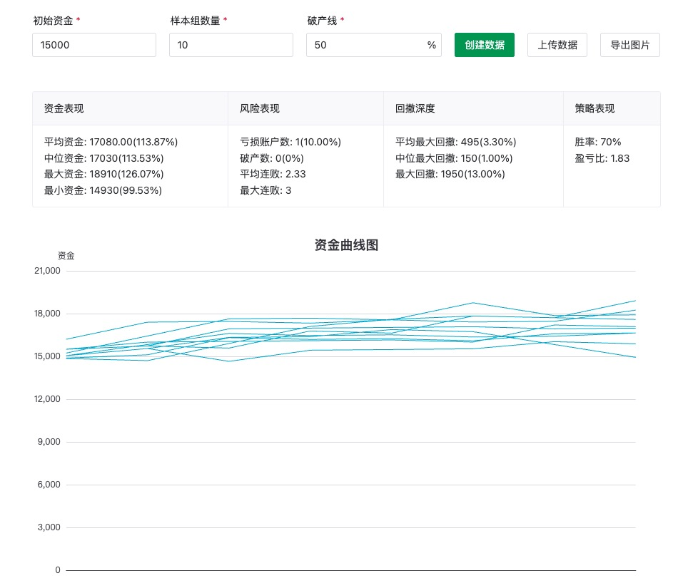
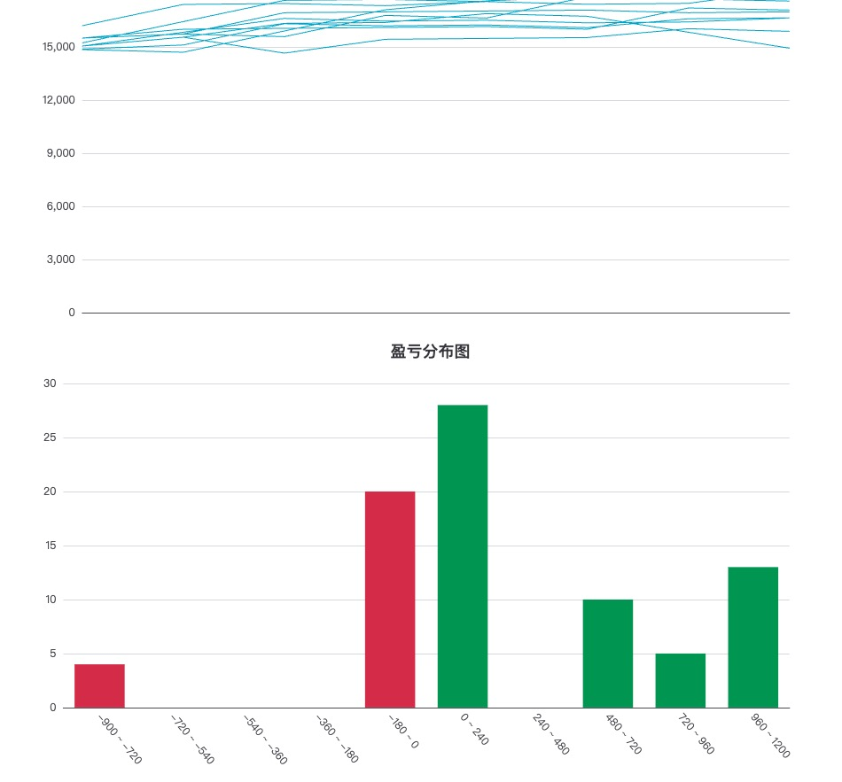

# 蒙特卡罗测试

基于交易策略的历史收益数据，测试交易策略的收益、胜率等结果。

## 使用说明

1. 将 profit-template.xlsx 上传；
2. 创建数据；

注：
- profit-template.xlsx 中，profit 列的每一行值，对应交易中每一次的收益结果；
请确保每一行数据都是数字，否则上传失败，将无法进行测试。

## 表单字段说明：
- 初始资金：模拟账户的初始资金；
- 样本组数量：所要生成的模拟账户数量，目前最大数量限制为 300，实际使用中模拟数量不应太少，否则最终计算出的数据统计偏差较大；
- 破产线：以 50% 举例，当模拟账户执行完统计后，若剩余资金 < 7500(初始资金的 50%)，则算作破产，破产数 +1；

## 数据字段说明
- 资金表现： 
  - 平均资金/中位资金：二者相差不应较大，如果较大，意味着策略的收益并不稳定，收益结果存在“大亏大赚”特征；
- 风险表现：
  - 亏损账户数：（举例）100 个样本执行完策略后，初始资金 > 最终资金的个数；
  - 破产数：（举例）15000 初始资金的破产线为 50%，可得出最终剩余资金 < 7500, 即算作破产；
- 回撤深度：
  - 平均最大回撤/中位最大回撤：二者相差不应较大，如果较大，意味着策略的最大回撤并不稳定；
- 策略表现计算公式：
  - 胜率：总计盈利金额/总金额 * 100；
  - 盈亏比：(总计盈利金额/总计盈利次数)/(总计亏损金额/总计亏损次数)

## 案例展示

数据展示

数据图展示

